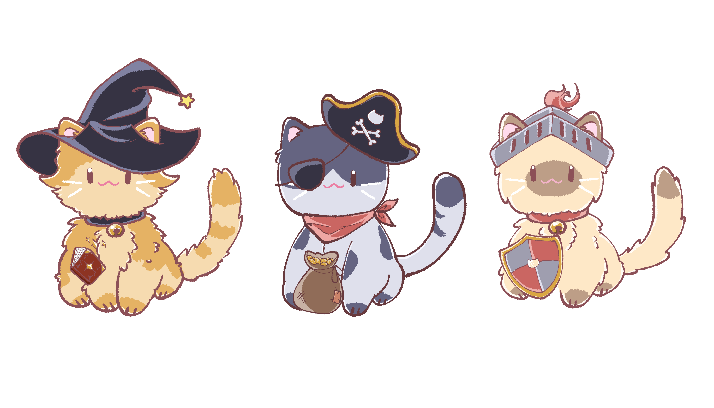
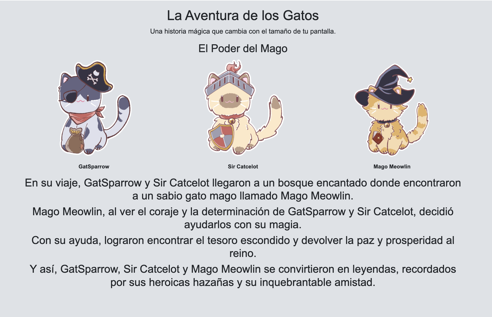

# La Aventura de los Gatos

Este proyecto es un ejemplo de una página web HTML que utiliza Bootstrap 5 para implementar un diseño responsivo adaptativo. La página cuenta la historia de "La Aventura de los Gatos", la cual varía según el tamaño de la pantalla del dispositivo utilizado.

## Contenido

### Estructura del Proyecto

El proyecto consta de un archivo HTML principal que incluye:

- **index.html**: Contiene la estructura básica del sitio web y las secciones de la historia adaptadas para diferentes tamaños de pantalla.

- **assets/**: Directorio que contiene las imágenes de los gatos utilizados en la historia.

### Componentes Utilizados

- **Bootstrap 5**: Se ha utilizado para el diseño responsivo y los estilos de la página web. Los estilos se importan desde CDN y se aplican a diferentes elementos como contenedores, columnas, imágenes fluidas, y estilos de texto.

### Secciones de la Historia

La historia está dividida en tres secciones principales, cada una diseñada para pantallas de diferentes tamaños:

- **Pantallas Pequeñas (< 768px)**: Introduce el personaje principal, GatSparrow, y su aventura inicial como gato pirata.

- **Pantallas Medianas (>= 768px y < 992px)**: Expande la historia introduciendo a Sir Catcelot, un caballero que se une a la búsqueda del tesoro.

- **Pantallas Grandes (>= 992px)**: Completa la historia con la introducción de Mago Meowlin, quien ayuda a GatSparrow y Sir Catcelot a encontrar el tesoro perdido.

### Captura de Pantalla

### Tecnologías Utilizadas

- **HTML5**: Para la estructura básica del documento web.
- **CSS3**: Para estilos personalizados además de los proporcionados por Bootstrap.

### Ejecución Local

Para ejecutar este proyecto localmente:

1. Clona este repositorio o descarga el archivo `index.html` y la carpeta `assets`.
2. Abre el archivo `index.html` en cualquier navegador web moderno.

### Contribución

Siéntete libre de contribuir a este proyecto abriendo problemas o enviando solicitudes de extracción. ¡Toda contribución es bienvenida!

